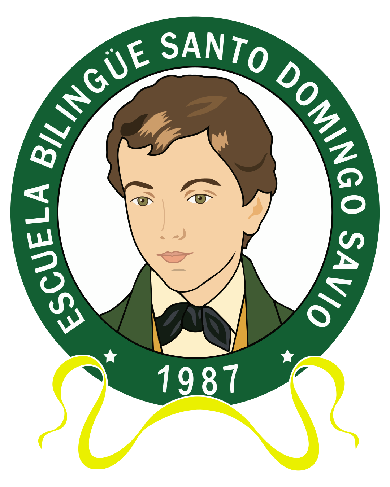

# Escuela Bilingüe Santo Domingo Savio



Sitio web institucional de la **Escuela Bilingüe Santo Domingo Savio**, centro educativo católico salesiano en Don Bosco, Panamá. Formación integral bilingüe bajo el Sistema Preventivo de Don Bosco, desde Prekínder hasta Bachillerato.

## 🚀 Stack

| Tecnología | Versión |
|---|---|
| [Next.js](https://nextjs.org/) | 15 |
| [React](https://react.dev/) | 19 |
| [TypeScript](https://www.typescriptlang.org/) | 5 |
| [Tailwind CSS](https://tailwindcss.com/) | 4 |
| [Framer Motion](https://www.framer.com/motion/) | 11 |
| [next-intl](https://next-intl-docs.vercel.app/) | 4 |

## 📁 Estructura

```
├── app/
│   ├── [locale]/              ← Routing por idioma (es/en)
│   │   ├── page.tsx            ← Inicio
│   │   ├── layout.tsx          ← Layout raíz (Header, Footer, CookieBanner)
│   │   ├── loading.tsx         ← Estado de carga
│   │   ├── error.tsx           ← Página de error 500
│   │   ├── not-found.tsx       ← Página 404
│   │   ├── nosotros/           ← Quiénes somos
│   │   ├── oferta-academica/   ← Niveles y asignaturas
│   │   ├── admisiones/         ← Proceso, tarifario, FAQ
│   │   ├── vida-escolar/       ← Galería y video
│   │   ├── contacto/           ← Info + formulario
│   │   └── privacidad/         ← Aviso de privacidad (Ley 81)
│   ├── api/contact/            ← API de formulario de contacto
│   ├── globals.css             ← Design tokens y estilos base
│   ├── sitemap.ts              ← Sitemap dinámico
│   └── robots.ts               ← Robots.txt
├── components/
│   ├── Header.tsx              ← Navegación sticky + menú móvil
│   ├── Footer.tsx              ← Footer con CTA y columnas
│   ├── CookieBanner.tsx        ← Banner de consentimiento de cookies
│   ├── ContactForm.tsx         ← Formulario de contacto
│   ├── Hero.tsx                ← Hero de la página de inicio
│   ├── PageHero.tsx            ← Hero genérico para páginas internas
│   ├── Accordion.tsx           ← Acordeón FAQ
│   ├── Figure.tsx              ← Imagen con duotono editorial
│   ├── PhotoSlot.tsx           ← Placeholder fotográfico
│   ├── Reveal.tsx              ← Animaciones de scroll
│   └── ui.tsx                  ← Eyebrow, GlowButton, SectionHeading, Stat
├── lib/
│   ├── site.ts                 ← Datos institucionales centralizados
│   └── photos.ts               ← Fotos centralizadas (placeholders)
├── i18n/
│   ├── routing.ts              ← Configuración de locales
│   ├── navigation.ts           ← APIs de navegación i18n
│   └── request.ts              ← Carga de mensajes por locale
├── messages/
│   ├── es.json                 ← Traducciones español
│   └── en.json                 ← Traducciones inglés
└── public/
    └── logo.svg                ← Escudo institucional
```

## 🛠️ Desarrollo

```bash
# Instalar dependencias
npm install

# Servidor de desarrollo (puerto 3000)
npm run dev

# Build de producción
npm run build

# Iniciar servidor de producción
npm run start

# Linting
npm run lint
```

## 🌐 Internacionalización

El sitio está disponible en **español** (`/es`) y **inglés** (`/en`). El español es el idioma por defecto.

Las traducciones se gestionan con `next-intl` y se encuentran en `messages/`.

## 📸 Fotos

Las fotos están centralizadas en `lib/photos.ts`. Actualmente se usan imágenes temporales de Lorem Picsum. Cuando el colegio entregue sus fotos reales:

1. Colocar las imágenes en `public/photos/`
2. Reemplazar las rutas en `lib/photos.ts`:
```ts
homeIntro: "/photos/inicio.jpg",
journey: ["/photos/prekinder.jpg", ...],
// etc.
```

## 📧 Formulario de contacto

El formulario envía datos a `app/api/contact/route.ts`. Está preparado para integrar [Resend](https://resend.com/) para el envío de correos. Para activarlo:

1. Instalar: `npm install resend`
2. Agregar `RESEND_API_KEY` al `.env.local`
3. Descomentar el bloque de envío en `app/api/contact/route.ts`

## 🔒 Privacidad y cookies

El sitio cumple con la **Ley 81 de Protección de Datos Personales de la República de Panamá**:

- **Aviso de Privacidad** completo en `/privacidad`
- **Banner de cookies** con opciones de aceptar, rechazar o configurar
- **Derechos ARCO** (Acceso, Rectificación, Cancelación, Oposición) detallados
- **Protección de datos de menores** conforme al artículo 20

## 🎨 Diseño

- **Tipografía**: Fraunces (serif, titulares) + Plus Jakarta Sans (sans, cuerpo)
- **Paleta**: Verde esmeralda, celeste, dorado, coral — tonos cálidos editoriales
- **Estética**: Revista educativa, no dashboard. Cálido, humano, salesiano.

---

Hecho con cariño en Don Bosco, Panamá ☕
